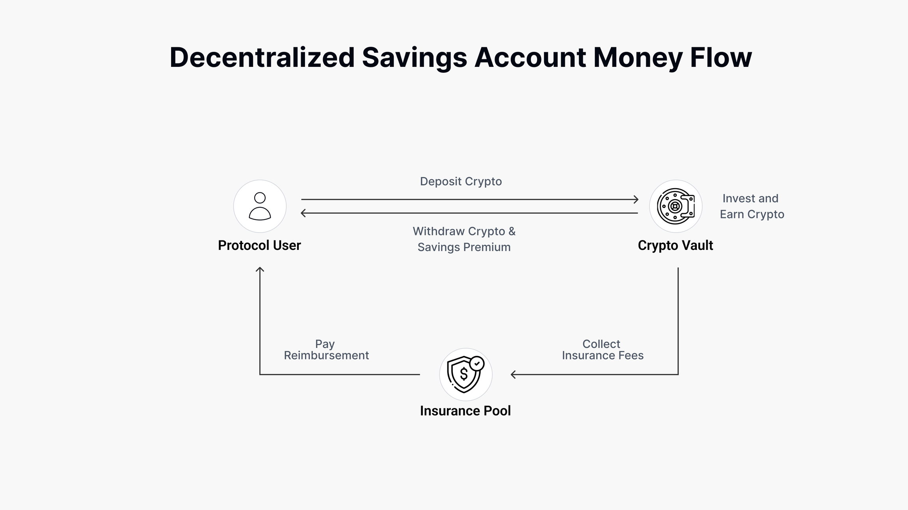
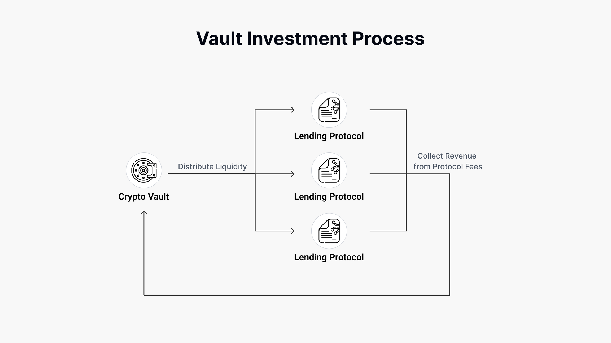
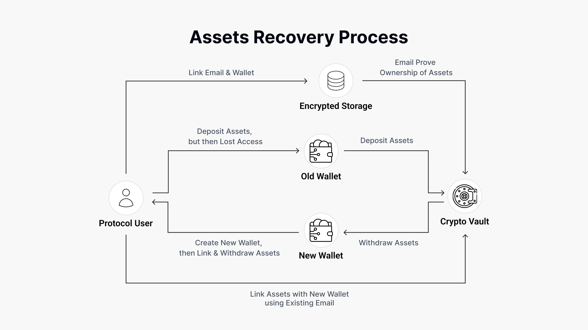

# Eonian Farm

Decentralized savings account protocol and subgraph. More info in [docs](docs.eonian.finance).

## Archutecture

In readme explained only upper level architecture. For more details see [How Eonian Works docs](https://docs.eonian.finance/basics/how-eonian-works).

### Savings Account Money Flow



### Investments Process



### Recovery Process



## Audits

All audits and security reviews are available in [audits](https://docs.eonian.finance/security/protocol-audits) section.

In this repo you can find only [main audits](./audits).

## Development

This mono-repository contains protocol contracts and dApp code, as well as all related packages.

For a list of known development issues related to Lerna monorepo, see [development.md](https://github.com/eonian-core/farm/tree/main/development.md).

### Structure

* `packages/contracts` - Protocol contracts.
* `packages/subgraph` - GraphQl API for protocol.
* `packages/eslint-config` - Shared JS code linting config.

### Requirements

Install required tools for development

* [Foundry](https://book.getfoundry.sh/getting-started/installation.html) - The testing framework for solidity
* [NodeJS](https://nodejs.org/) - Execution environment for JS

### First Start Guide

1) Install packages from npm and forge

```bash
yarn
```

2) Open the package which you want to start
    * `cd packages/contract` - Open contracts package

3) Follow the guide of the package which you want to start
    * [contracts/readme.md](https://github.com/eonian-core/farm/tree/main/packages/contracts#readme)

### Commands

* `yarn start` - start pre-prod environment
* `yarn dev` - start dev environment
* `yarn test` - run tests in packages
* `yarn build:contracts` - Build only contracts
* `yarn test:contracts` - Test only contracts
* `dev:contracts` - Set up a development environment for contracts. Watch file changes and rerun tests.

## Deployment

The deployment process focused on implementing GitOps practices. Basically, it means all master (main) builds go to production directly.
